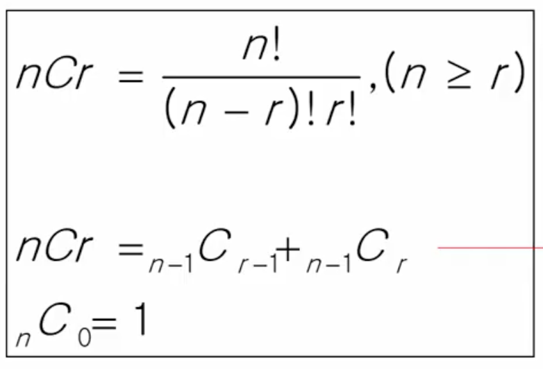

## 반복 Iteration / 재귀 Recursion
반복과 재귀는 유사한 작업을 수행할 수 있다  
#### 반복 
: 수행하는 작업이 완료될 때까지 반복  
: 루프 (for, while 반복)  

- 반복 구조
    - 초기화  
    반복되는 명령문을 실행하기 전에 조건 검사에 사용할 변수의 초기값 설정
    - 조건 검사 check control expression
    - 반복할 명령문 실행 action
    - 업데이트 loop update  
    무한루프가 되지 않게 조건이 거짓False이 되게 한다  


- 반족을 이용한 선택 정렬
```python
def SelectionSort(A):
    n = len(A)
    for i in range(0, n-1):
        minI = i
        for j in range(i+1, n):
            if A[j] < A[minI]:
                minI = j
        A[minI], A[i] = A[i], A[minI]
```

#### 재귀 
: 주어진 문제의 해를 구하기 위해 동일하면서 더 작은 문제의 해를 이용하는 방법    
: 하나의 큰 문제를 해결할 수 있는 더 작은 문제로 쪼개고 결과들을 결합   
: 재귀함수로 구현

# 완전 검색 기법
##### baby-gin 게임


## 순열 Permutation
- 단순하게 순열을 생성하는 방법   
예) {1, 2, 3}을 포함하는 모든 순열을 생성하는 함수 
```python
# 동일한 숫자가 포함되지 않았을 때, 각 자리수 별로 loop를 이용
for i1 in range(1,4):
    for i2 in range(1,4):
        if i1 != i2:
            for i3 in range(1,4):
                if i3 != i1 and i3 != i2 :
                    print(i1, i2, i3)
```

- 재귀 호출을 통한 순열 생성
```python
def f(i, k):
    if i == k :        # index i == 원소의 개수
        print(k, end=' ')
    else:
        for j in range(i, k):
            p[i], [j] = p[j], p[i]
            f(i+1, k)
            p[i], [j] = p[j], p[i]
p = [1, 2, 3]
f(0, 3)
# [1, 2, 3] [1, 3, 2] [2, 1, 3] [2, 3, 1] [3, 2, 1] [3, 1, 2 ]
```

- N개의 요소에 대한 순열(nPn)
```python
# p[] : 순열을 저장할 배열
# arr[i] : 순열을 만드는 데 사용할 숫자 배열
# n : 원소의 개수,  i : 선택된 원소의 수
# used[N-1] : 사용 여부 -> p[] : 결과 저장 배열
perm(n, k): 
    if n == k:
        print(p)
    else:
        for i in range(k):        # 모든 원소에 대해
            if used[i] == 0:           # 사용된 적이 없으면
                p[n] == arr[i]         # 순열에 사용
                used[i] = 1 
                p[n] = arr[i]          # p[n]은 arr[i]로 결정
                perm(i+1, k)
                used[i] = 0        # 다른 자리에서 사용가능하게 False로 표시

N = 3
a = [i for i in range(1, N+1)]
used = [0] * N
p = [0] * N
perm(0, N)
```
- k개 중에 r개만 고르기 (nPr)
```python
# k개 중에 r개만 고르기 (nPr)
f(n, k, r):
    if n == r:
        print(p)
    else:
        for i in range(k):        # 모든 원소에 대해
            if used[i] == 0:           # 사용된 적이 없으면
                p[n] == arr[i]         # 순열에 사용
                used[i] = 1 
                p[n] = arr[i]          # p[n]은 arr[i]로 결정
                f(i+1, k, r)
                used[i] = 0        # 다른 자리에서 사용가능하게 False로 표시

N = 3
R = 3
a = [i for i in range(1, N+1)]
used = [0] * N
p = [0] * R
f(0, N, R)
```

[문제] 배열 최소 합
```python
def f(i, k):
    global minV
    if i == k:
        s = 0
        for j in range(k):
            s += arr[j][p[l]]
        if minV > s:
            minV = s
    else:
        for j in range(i, k):
            p[i], p[j] = p[j], p[i]
            f(i+1, k)
            p[i], p[j] = p[j], p[i]

T = int(input())
for tc in range(1, T+1):
    N = int(input())
    arr = [list(map(int, input().split())) for _ in range(N)]
    p = [i for i in range(N)]
    minV = N * 10
    f(0, N)
    print(f'#{tc} {minV}')

```

## 부분 집합
집합에 포함된 원소들을 선택하는 것  
e.g. 배낭 짐싸기 knapsack  
- N개의 원소를 포함한 집합  
    - 자기 자신과 공집합을 포함한 모든 부분집합(power set)의 개수는 2^n개
    - 원소의 수가 증가하면 부분집합의 개수는 지수적으로 증가
- 단순하게 모든 부분 집합 생성하는 법
```python
for i1 in range(0, 2):
    bit[0] = i1
    for i2 in range(0, 2):
        bit[1] = i2
        for i3 in range(0, 2):
            bit[2] = i3
            for i4 in range(0, 2):
                bit[3] = i4
                print(array)
```
- **바이너리 카운팅**을 통한 사전적 순서(Lexicographic Order)
    - 부분집합을 생성하기 위한 가장 자연스러운 방법
    - 바이너리 카운팅 Binary counting 은 사전적 순서로 생성하기 위한 가장 간단한 방법
    - 원소 수에 해당하는 N개의 비트열을 활용
    - n번째 비트값이 1이면 n번째 원소가 포함되었음을 의미함
    ```python
    arr = [3, 6, 7, 1, 5, 4]
    n = len(arr)

    for i in range(1, 1 << n): # 1 << n 부분집합의 개수
        for j in range(n):
            if i & (1 << j): # j번 비트가 0이 아니면 arr[j] 부분집합의 원소
                print(arr[j], end=' ')
        print()
    ```
    ```python
    def f(i, k):
        if i == k:
            print(bit)
            for j in range(k):
                if bit[j]:
                    print(arr[j], end=' ')
            print()
        else:
            bit[i] = 0
            f(i+1, k)
            bit[i] = 1
            f(i+1, k)
    arr = [3, 6, 7, 1, 5, 4]
    n = len(arr)
    bit = [0] * N
    f(0, n)
    ```

## 조합 Combination
서로 다른 n개의 원소 중 r개의 원소를 순서없이 고르는 것  

- 재귀 호출을 이용한 조합 생성 알고리즘
```python
an[] : n개의 원소를 가지고 있는 배열
tr[] : r 크기의 배열, 조합이 임시 저장될 배열

comb(n, r):
    if r == 0:
        print(arr)
    elif:
        if n < r:
            return
    else:
        tr[r-1] = an[r-1]
        comb(n-1, r-1)
        comb(n-1, r)
```

- N개의 원소 중 3개를 고르는 조합 
    - i < j < k라면, 
```python
for i in range(0, N - 3):
    for j in range(i + 1, N - 2):
        for k in range(j + 1, N - 1) :
            f(a[i], a[j], a[k])

```
- N개의 원소 중 r개를 고르는 조합(재귀) 
```python
def nCr(n, r, s):   # s: 선택할 수 있는 구간의 시작
    if r == 0:
        print(*comb)
    else:
        for i in range(s, n-r+1):   # 구간 시작s부터~ n-r+1 확인할 수 있는 조합의 개수
            comb[r-1] = A[i]       
            nCr(n, r-1, i+1)
A = [1, 2, 3, 4, 5]
n = len(A)
r = 3
comb = [0] * r
nCr(n, r, 0)
```