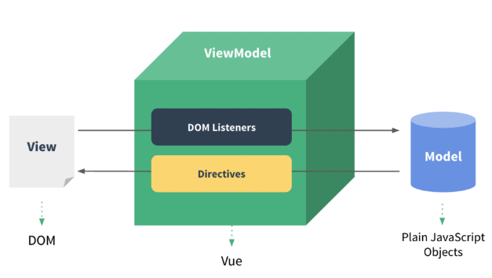

# Vue

#### Web App
- WebApp : 웹 브라우저에서 실행되는 어플리케이션 소프트웨어
- 개발자 도구 > 디바이스 모드
- 웹 페이지가 그대로 보이는 것이 아닌 `디바이스에 설치된 App처럼 보이는 것`
- 웹 페이지가 디바이스에 맞는 적절한 UX/UI로 표현되는 형태

### SPA(Single Page Application)
- 이전까지는 사용자의 요청에 적절한 페이지 별 template를 반환
- SPA: 서버에서 최초 1장의 HTML만을 전달받아 모든 요청에 대응하는 방식
    - CSR(Client Side Rendering) 방식으로 요청을 처리하기 때문


### CSR(Client Side Rendering)
- 최초의 한장의 HTML을 받아오는 것은 동일하나 server로부터 최초로 받아오는 문서는 빈 html문서 
- 각 요청에 대한 대응을 Javascript를 사용하여 필요한 부분만 다시 렌더링 
    1. 새로운 페이지를 서버에 `AJAX`로 요청
    2. 서버는 화면에 필요한 데이터를 JSON방식으로 전달
    3. `JSON` 데이터를 Javascript로 처리, DOM 트리에 반영(렌더링)
```js
axios.get(
    HOST_URL, 
    {
        headers:{
            Authorization: `Token${key}`
        }
    }
)
.then(res => {
    this.todos = res.data
})
.catch(err => console.log(err))
```

##### [참고] SSR(Server Side Rendering)
- 기존 요청 처리 방식은 SSR
- Server가 사용자의 요청에 적합한 HTML을 렌더링하여 제공하는 방식
- 전달받은 새 문서를 보여주기 위해서 브라우저는 새로고침을 진행  

#### CSR을 사용하는 이유
1. 모든 HTML페이지를 서버로부터 받아서 표시하지 않아도 됨  
    == 클라이언트 - 서버 간 통신, 즉 트래픽 감소  
    == 트래픽 감소 = 빠른 응답 속도
2. 매번 새 문서를 받아 새로고침하는 것이 아니라 필요한 부분만 고쳐 나가므로 각 요청이 끊김없이 진행
    - SNS에서 추천을 누를 때마다 첫 페이지로 돌아가 ..? 
    - 요청이 자연스럽게 진행된다 == UX 향상
3. BE와 FE의 작업 영역을 명확히 분리할 수 있음 
    - 협업이 용이해짐 

#### CSR을 사용하는 데 있어서의 문제점
- 첫 구동 시 필요한 데이터가 많으면 많ㅇ르수록 최초 작동시작까지 오랜시간이 소요됨
- Naver, Netflix, Disney+등 모바일에 설치된 Web-App을 실행하게되면 잠깐의 로딩시간이 필요함 
- `검색 엔진 최적화(SEO, Search Engine Optimization)`이 어려움
    - 서버가 제공하는 것은 텅 빈 HTML
    - 내용을 채우는 것은 AJAX 요청으로 얻은 JSON 데이터로 클라이언트(브라우저)가 진행
- 대체적으로 HTML에 작성된 내용을 기반으로 하는 검색 엔진에 빈 HTML을 공유하는 SPA 서비스가 노출되기는 어려움

##### [참고] SEO(Search Engine Optimization)
- google, bing과 같은 검색 엔진 등에 내 서비스나 제품 등이 효율적으로 검색 엔진에 노출되도록 개선하는 과정을 일컫는 작업
- 검색 = 각 사이트가 운용하는 검색 엔진에 의해 이루어지는 작업
- 검색 엔진 = 웹 상에 존재하는 가능한 모든 정보들을 긁어모으는 방식으로 동작함
    - 정보의 대상은 주로 HTML에 작성된 내용
    - Javascript가 실행된 이후의 결과를 확인하는 과정이 없음 
- SPA, 즉 CRS로 구성된 서비스의 비중이 증가
    - SPA 서비스도 검색 대상으로 넓히기 위해 JS를 지원하는 방식으로 발전
- 단순 HTML만을 분석하는 것보다 몇 배의 리소스가 필요한 작업이기에 여전히 CSR의 검색 엔진 최적화 문제가 모두 해결된 것은 아님 


> 대부분의 기업에서는 생산성과 협업을 위해 Framework를 사용해서 개발


## Vue
#### Vue CDN
- Django == Python Web Framework
    - pip install
- Vue === JS Front-end Framework
    - https://v2.vuejs.org/
    - Getting started -> Installation -> Development version CDN 복사
    - `<script src="https://cdn.jsdelivr.net/npm/vue@2/dist/vue.js"></script>` CDN 입력

### Vue 코드 작성하기
1. Vue CDN 가져오기
2. Vue instance 생성
    - Vue instance - 1개의 object
    - 정해진 속성명을 가진 object
3. `el, data` 설정
    - data에 관리할 속성 정의
4. 선언적 렌더링 `{{ }}`
    - Vue data를 화면에 렌더링
```html
<body>
  <div id="app">
    <p id="name">name : {{ message }} </p>
    <input id="inputName" type="text" v-model="message"> <!--v-model="message"을 적용하므로써 -->
  </div>
  
  <script src="https://cdn.jsdelivr.net/npm/vue@2/dist/vue.js"></script>
  <script>
    // CODE HERE
    // 생성자 함수
    const app = new Vue({
      el: '#app',
      data: {
      message: '',
    }
  })
  </script>
</body>
```
- input 태그에 `v-model` 작성
    - input에 값 작성 -> vue data 반영
    - vue data -> DOM 반영

## Vue Instance
#### MVVM Pattern
- 소프트웨어 아키텍처 패턴의 일종
- 마크업 언어로 구현하는 그래픽 사용자 인터페이스(view)의 개발을 Backend(model)로부터 분리시켜 view가 어느 특정한 모델 플랫폼에 종속되지 않도록 함


- `View` - 우리 눈에 보이는 부분 `DOM`
- `Model` - 실제 데이터 `JSON`
- `View Model`(Vue)
    - View를 위한 Model
    - View와 연결(binding)이 되어 Action을 주고 받음
    - Model이 변경되면 View Model도 변경되고 바인딩된 View도 변경됨
    - View에서 사용자가 데이터를 변경하면 View Model의 데이터가 변경되고 바인딩된 다른 View도 변경됨 
- MVC 패턴에서 Controller을 제외하고 `View Model`을 넣은 패턴
- View는 Model을 모르고, Model도 View를 모름
    - DOM은 data를 모른다. data도 DOM을 모른다. (`독립성 증가, 적은 의존성`)
- View에서 데이터를 변경하면 View Model의 데이터가 변경되고, 연관된 다른 View도 함께 변경됨
    - 각 각 서로 구역이 독립적임

### Vue instance
- `new` 연산자를 사용하여 생성자 함수 호출
    - vue instance 생성
```html
<script src="https://cdn.jsdelivr.net/npm/vue@2/dist/vue.js"></script>
  <script>
      // CODE HERE
    // 1. Vue instance constructor
    const vm = new Vue()
    console.log(vm)
</script>
```
- vue instance === 1개의 객체


##### [참고] 생성자 함수(constructor function)
동일한 구조의 객체를 여러 개 만들 때는 `new`연산자와 생성자 함수를 사용
- 생성자 함수를 사용할 때는 반드시 `new`연산자로 사용하는 함수
- 생성자 함수 이름은 반드시 대문자로 시작
- 생성자 함수의 알고리즘
    1. 빈 객체를 만들어 this에 할당합니다.
    2. 함수 본문을 실행합니다. this에 새로운 프로퍼티를 추가해 this를 수정합니다.
    3. this를 반환합니다.  
- 목적: 재사용할 수 있는 객체 생성 코드를 구현
```js
function Member(name, age, sID){
    // this = {};  (빈 객체가 암시적으로 만들어짐)

    this.name = name
    this.age = age
    this.sId = sId

    // return this;  (this가 암시적으로 반환됨)
}
// 생성자 함수
const memeber3 = new Member('isaac', 21, 2022654321)
```

### el(element)
- Vue instance와 DOM을 연결(mount)하는 옵션
    - View와 Model을 연결하는 역할
    - HTML id 혹은 class와 mount 가능
- Vue instance와 연결되지 않은 DOM 외부는 Vue의 영향을 받지 않음 
    - Vue 속성 및 메서드 사용 불가
```html
<body>
    <div id="app">
        {{ message }}  <!--'Text interpolation'의 내용이 출력됨(View Model로 인해서 View와 Model이 mount됨)--> 
    </div>

    <div>
        {{ message }} <!--{{ message }} 그대로 출력됨-->
    </div>
    <!-- <script> Vue CDN </script>-->
    <script>
        const app = new Vue({ // 새로운 Vue 인스턴스 생성
            // 생성자 함수 첫번째 인자로 Object 작성
            el: '#app',  // 위의 #app 아이디를 가진 DOM과 연결됨
            data: {  // MVVM 패턴에서 Model을 담당
                message: 'Text interpolation',
                rawHTML: '<span style="color:red"> 빨간 글씨</span>'
            }
        })
    </script>
</body>
```

### data
- Vue instance의 `데이터 객체` 혹은 `인스턴스 속성`
- 데이터 객체는 반드시 `기본 객체 {}(Object)`이어야 함
- 객체 내부의 아이템들은 value로 모든 타입의 객체를 가질 수 있음
- 정의된 속성은 `interpolation`{{ }}을 통해 view에 렌더링 가능함
- 추가된 객체의 각 값들은 `this.message`형태로 접근 가능

### method
- Vew instance의 method들을 정의하는 곳
- methods 객체 정의
```html
<!-- 객체 내 print method 정의 
print method 실행시 Vue instance의 data 내 message 출력
콘솔창에서 app.print() 실행-->
<body>
    <script>
        const app = new Vue({
            el: '...',
            data: {...},
            methods: {
                    print: function () {
                        console.log(this.message)  //여기서 this는 위의 const app 이라는 vue 객체를 가리킴
                        console.log(this.$data.message)  // View에 정해진 속성값을 의미함. 다른 이름과 겹치지 않도록 설정함. 내부적으로 이용하고 있는 속성값을 의미함.
                    },
                    // 하나의 데이터를 재사용
                    /*method를 호출하여 data 변경 가능 - 객체 내 bye method 정의
                    print method 실행시 Vue instance의 data 내 message 변경 
                    - 콘솔창에서 app.bye()실행 
                        - DOM에 변경된 결과를 바로 반영
                        - Vue의 강력한 반응성(reactivity)*/
                    bye: function () {
                        this.message = 'Bye, Vue!' // this.message를 Bye, Vue로 변경
                    },
            }
        })
    </script>
</body>
```


##### [주의] methods with Arrow Function
- `메서드를 정의(선언)할 때, Arrow Function를 사용하면 안됨`
    - `(메서드 안에서는 사용해도 됨)`
- Arrow Function의 this는 함수가 선언될 때 상위 스코프를 가리킴
- this => window를 가리킴
- 호출은 문제없이 가능하나 this로 Vue의 data를 변경하지는 못함
```js
const app = new Vue({
    el: '#app',
    data: {
        message:'hello vue',
    },
    methods: {                
        arrowBye: () => {
                    this.message = 'Arrow Function?'
                    console.log(this)
                }
    }
})
```

## Vue 기초 문법
### Template Syntax
- Vue2 guide > Template Syntax 참고
- `렌더링된 DOM`을 기본 Vue Instance의 data에 `선언적으로 바인딩`할 수 있는 `HTML기반 template syntax를 사용`
    - 렌더링된 DOM - 브라우저에 의해 보기 좋게 그려질 HTML 코드
    - HTML기반 template syntax - HTML 코드에 직접 작성할 수 있는 문법 제공
    - 선언적으로 바인딩 - Vue Instance와 DOM을 연결


### Directives
- `v-`접두사가 있는 특수 속성에는 값을 할당할 수 있음
    - 값에는 JS 표현식을 작성할 수 있음
- directive의 역할은 `표현식의 값이 변경될 때 반응적으로 DOM에 적용하는 것`

#### Directives 기본 구성

- `:`을 통해 전달인자를 받을 수 있음
- `.`으로 표시되는 특수 접미사 - directive를 특별한 방법으로 바인딩해야 함
```html
<!-- 2. v-text & v-html -->
<body>
  <div id="app2">
    <!-- 2-1. v-text & {{}} -->
    <p v-text="message"></p>
    <!-- 같음 -->
    <p>{{ message }}</p>

    <!-- 2-2. v-html -->
    <p v-html="html"></p>
  </div>

  <script>
    // 2. v-text && v-html
    const app2 = new Vue({
      el: '#app2',
      data: {
        message: 'Hello!',
        html: '<a href="https://www.google.com">GOOGLE</a>'
      }
    })
  </script>
</body>
```
- v-text
    - Template Interpolation과 함께 가장 기본적인 바인딩 방법
    - {{ }}과 유사한 역할
- v-html
    - RAW HTML을 표현할 수 있는 방법
    - 단, `사용자가 입력하거나 제공하는 컨텐츠에는 절대 사용 금지`